# UCLan-Shop

## Project Information

**Project title:** UCLan-Shop
**Student name:** Vladislav Vasilev
**Student ID:** G21303193
**Course:** BSc Computing Y2
**Module:** CO1418 – Web Technologies
**GitHub:** https://github.com/MockingbirdCopycatovich/UCLan-Shop

This project is a responsive front-end web application developed as part of **Assignment 1** for the module *Web Technologies (CO1418)*. The application represents an online **Student Union Shop** for the University of Central Lancashire, designed to sell discounted legacy merchandise.

---

## How to Run the Project

1. Download the submitted `.zip` file **or** clone the repository.
2. Open the project folder.
3. Navigate to the `html` directory.
4. Open `index.html` in a modern web browser (Chrome / Edge recommended).

> A short **video demonstration** of the application functionality has been provided via Blackboard, as required in the assignment brief.

---

## Project Directory Structure

```
UCLan-Shop/
│
├── html/
│   ├── index.html        # Homepage
│   ├── products.html     # Products listing and filtering
│   ├── item.html         # Individual product details
│   └── cart.html         # Shopping cart
│
├── css/
│   └── style.css         # Global styling and responsive design
│
├── js/
│   ├── index.js          # Mobile navigation (burger menu)
│   ├── products.js       # Products rendering, filtering, cart logic
│   ├── item.js           # Item page logic and cart interaction
│   └── cart.js           # Shopping cart functionality
│
├── media/
│   ├── images/           # Product images and assets
│   └── video/            # Homepage video
│
└── README.md
```

---

## Implemented Features Overview

### Homepage (`index.html`)

* Welcome message introducing the Student Union Shop
* Embedded **HTML5 video**
* Embedded **YouTube iframe** (external media)
* Semantic HTML structure (`header`, `main`, `section`, `footer`)
* Responsive navigation with hamburger menu for mobile devices

**Screenshot – Desktop:**
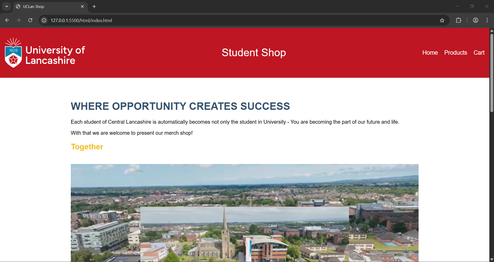
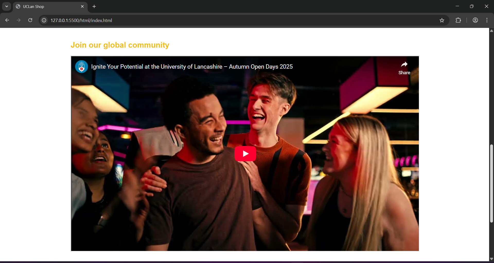


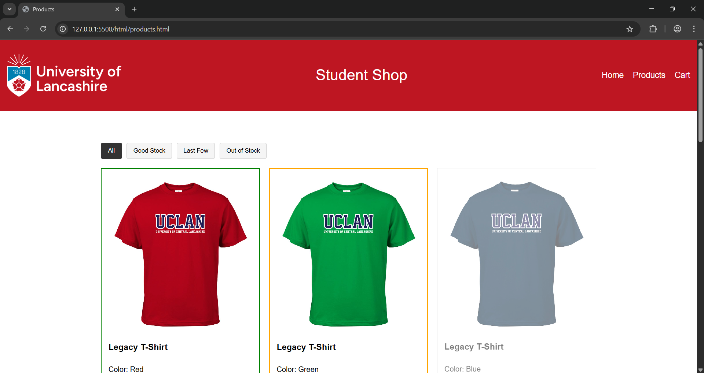
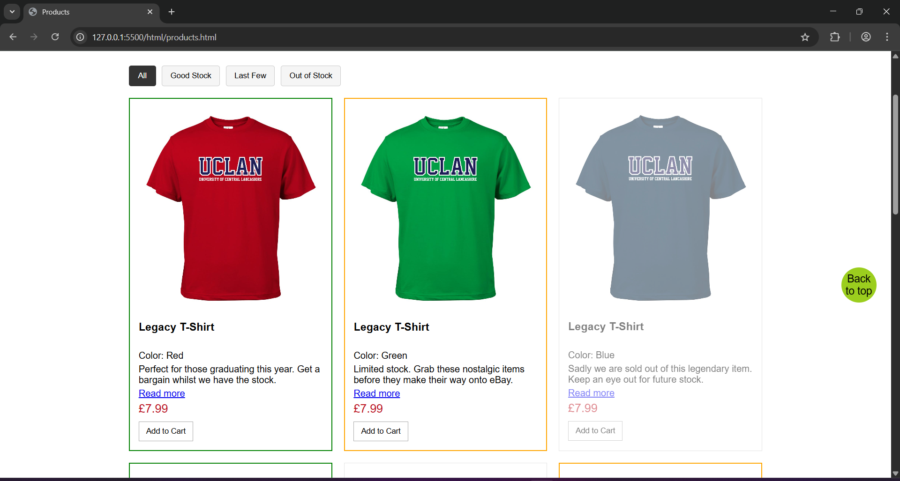
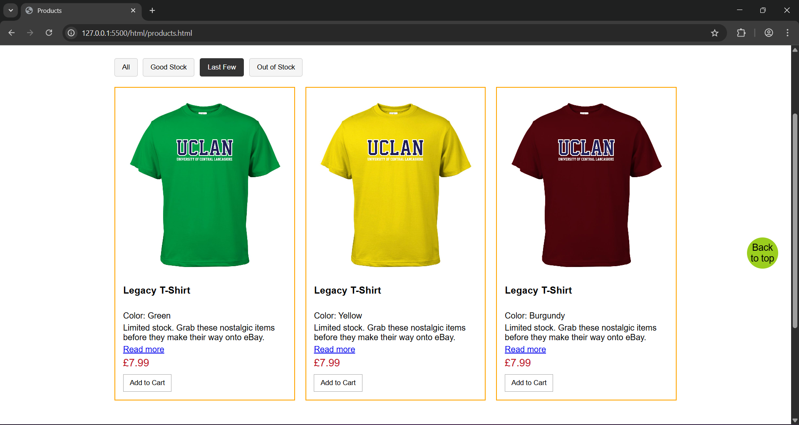
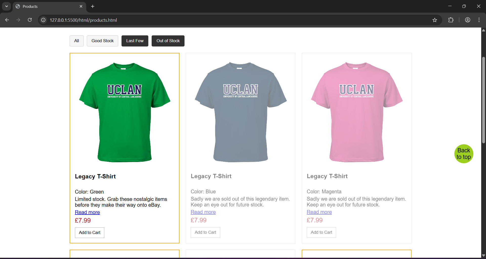
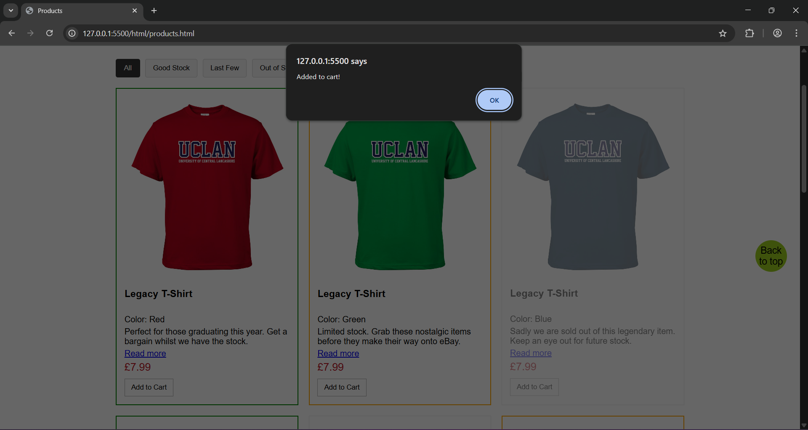

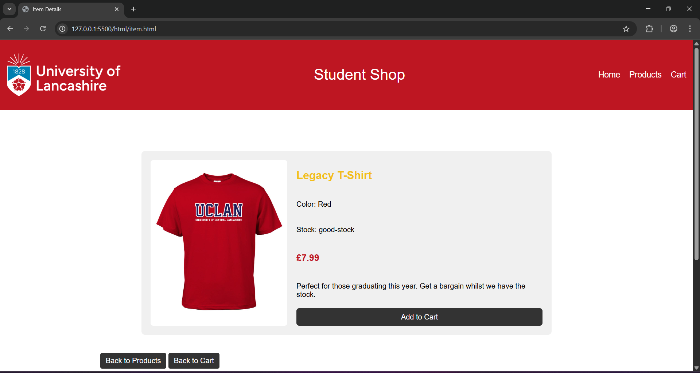
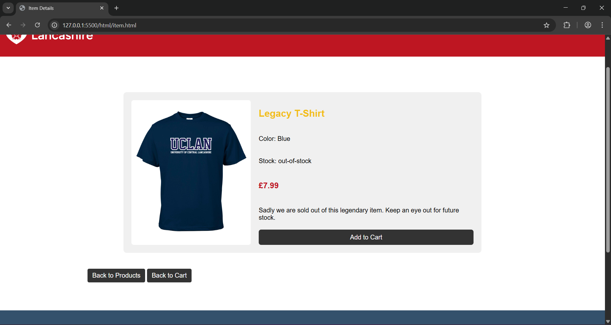

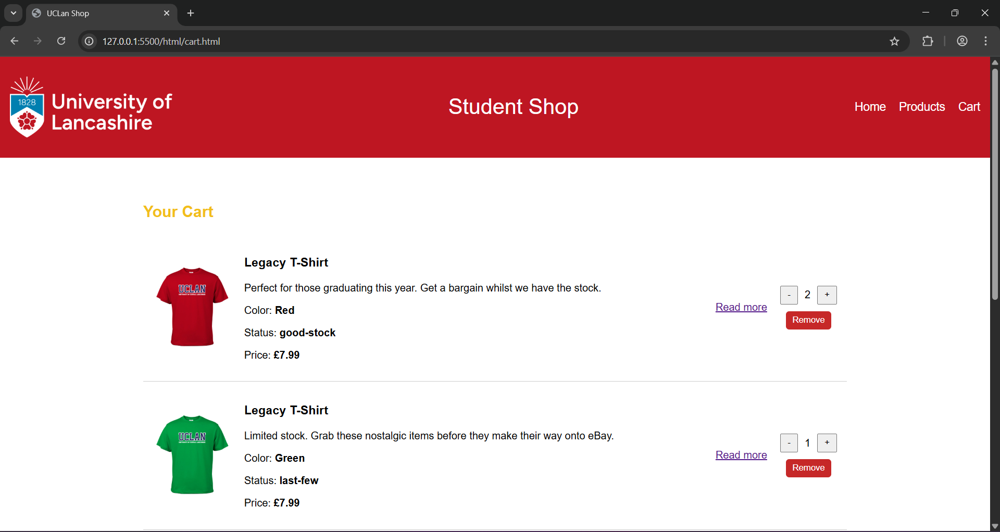
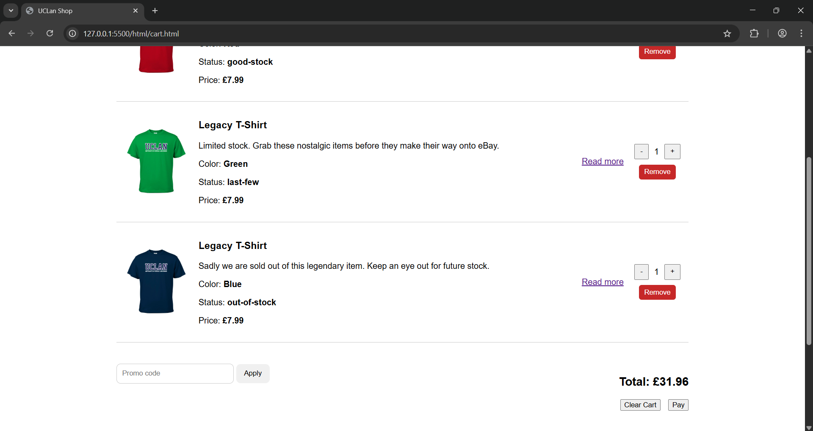
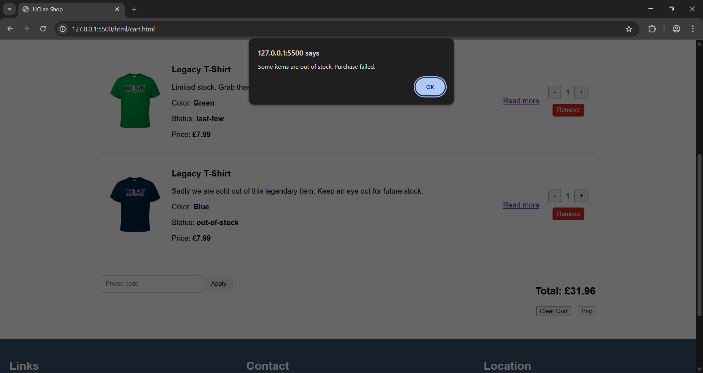
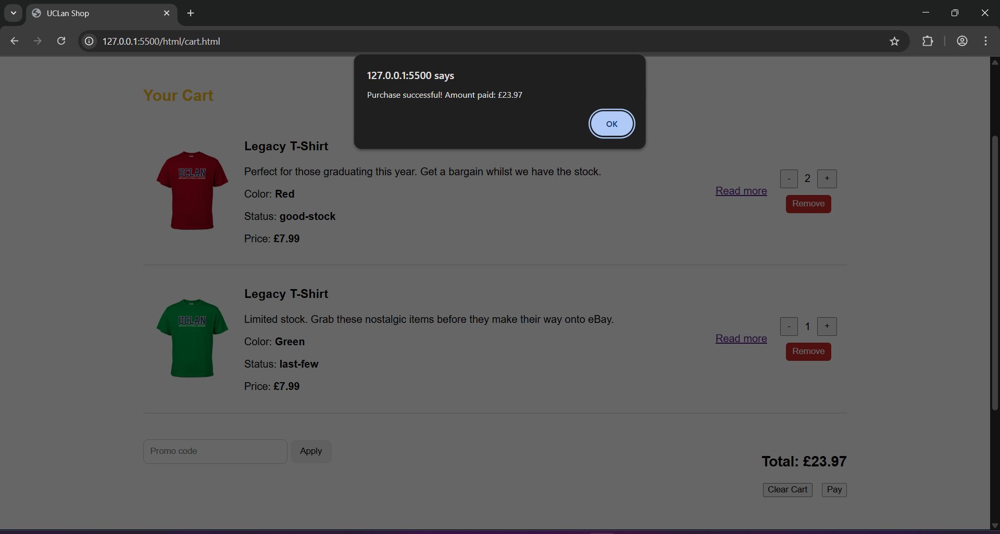
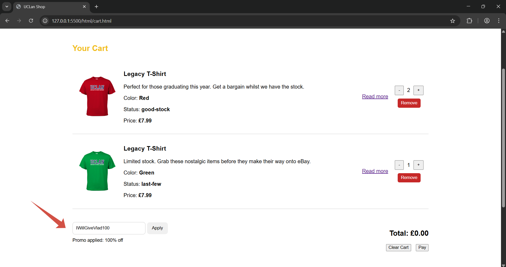
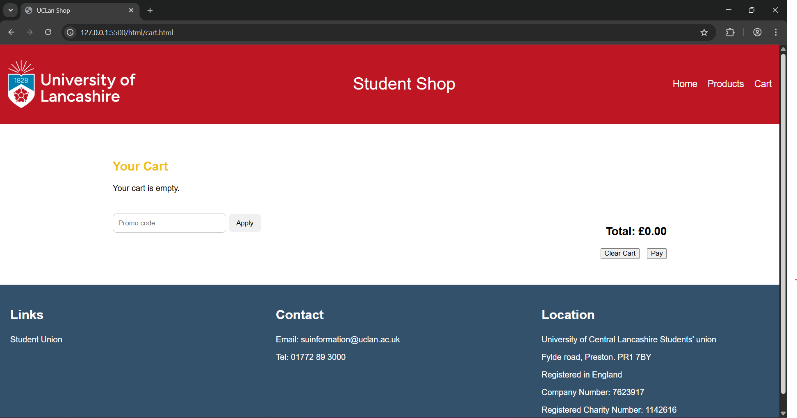

**Screenshot – Mobile:**
*(Insert homepage mobile screenshot here)*

---

### Products Page (`products.html`)

* Dynamic product listing generated using JavaScript
* Products loaded from an inventory array
* **Stock-based filtering**:

  * Good stock
  * Last few items
  * Out of stock
* Each stock category is visually differentiated using CSS
* "Back to top" button for improved usability
* Navigation to the item page via "Read more"

**JavaScript functionality (`products.js`):**

* DOM manipulation to generate product cards
* Filtering logic using JavaScript `Set`
* `sessionStorage` used to store the selected product (for item.html) and filters
* `localStorage` used to add products to the shopping cart
* Quantity tracking for identical items
* When changing pages, filters remain unchanged within a single session.

**Screenshot – Desktop:**
*(Insert products page desktop screenshot here)*

**Screenshot – Mobile:**
*(Insert products page mobile screenshot here)*

---

### Item Page (`item.html`)

* Accessible via the Products page and the Cart page
* Displays detailed information for the selected product
* Uses `sessionStorage` to retrieve product data
* "Add to Cart" functionality
* Graceful handling of direct access (error message displayed)

**JavaScript functionality (`item.js`):**

* Reads selected product from `sessionStorage`
* Dynamically renders product details
* Adds items to cart using `localStorage`
* Increases quantity if item already exists in cart

**Screenshot – Desktop:**
*(Insert item page desktop screenshot here)*

**Screenshot – Mobile:**
*(Insert item page mobile screenshot here)*

---

### Shopping Cart (`cart.html`)

* Fully functional shopping cart
* Cart contents persisted using `localStorage`
* Dynamic rendering of cart items
* Quantity controls (increase / decrease)
* Remove individual items
* Clear entire cart
* Simulated checkout process
* Navigation to the item page via "Read more"

**JavaScript functionality (`cart.js`):**

* Reads cart data from `localStorage`
* Updates quantities and recalculates totals
* Prevents checkout if cart is empty or items are out of stock

---

### Promo Code Functionality

* Promotional code input field
* Code validation and discount application
* Total order value recalculated dynamically

**Promo code:** `IWillGiveVlad100`
**Effect:** Applies a **100% discount** to the total order value

**Screenshot – Promo Code Applied:**
*(Insert promo code screenshot here)*

---

## Responsive Design

* Mobile-first considerations implemented
* Hamburger menu navigation for small screens
* Flexible layouts using CSS
* Fully usable on desktop and mobile devices

**Screenshot – Mobile Version:**
*(Insert mobile responsiveness screenshot here)*

---

## Accessibility Considerations

* Semantic HTML5 elements used throughout the application
* `alt` attributes provided for images
* Clear navigation structure
* Responsive and readable layout across devices

---

## Validation

* HTML validated using **W3C HTML Validator** with **no errors**
* CSS validated using **W3C CSS Validator** with **no errors**

---

## Known Limitations

* Checkout process is simulated (no backend integration)
* Only one promotional code is implemented

---

## Conclusion

This project demonstrates the use of modern front-end web development techniques, including responsive design, DOM manipulation, client-side storage (`sessionStorage` and `localStorage`), and semantic HTML. The application meets and exceeds the requirements outlined in the assignment brief.

## Link to 